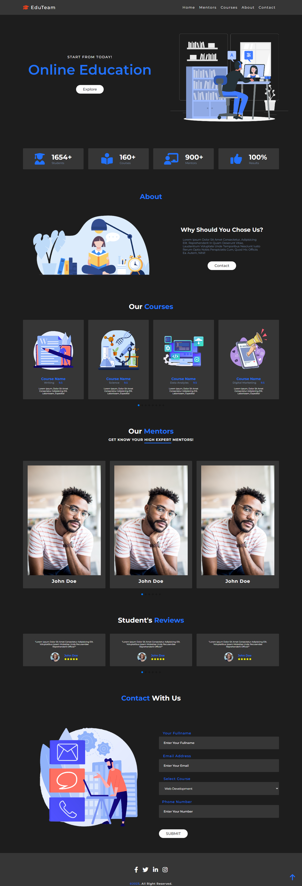

# Responsive Online Education Website Template Example

## Table Of Contents

- [Overview](#overview)
  - [Description](#description)
  - [Screenshot](#screenshot)
- [My process](#my-process)
  - [Built with](#built-with)

## Overview

### Description

  -This project is responsive education web page which can be adjusted for any devices (like smartphones, tablets, any small or big laptops) and single page website. That means you can navigate through site without leaving main page with menu links in navbar section (Home, Mentors etc.). Site was created with HTML, CSS and Javascript for interactivity as showing my skills I acquired the journey of my learning. This project was inspired from tutorial video from youtube. I added my own solutions for code and design changes for UI. As I added external resources (such as Icons , Fonts, Slider etc.) through CDN it is easy download this project use or recreate. Every images used are in images folder.

### Screenshot

  -This is desktop version screenshot image of project.
  

 
## My process

### Built with

- Semantic HTML5 markup
- CSS custom properties
- Flexbox
- CSS Grid
- Mobile-first workflow
- Vanilla Javascript
- Swiper JS

- Fonts used from Google Fonts with CDN
- Icons used from Font Awesome with CDN
